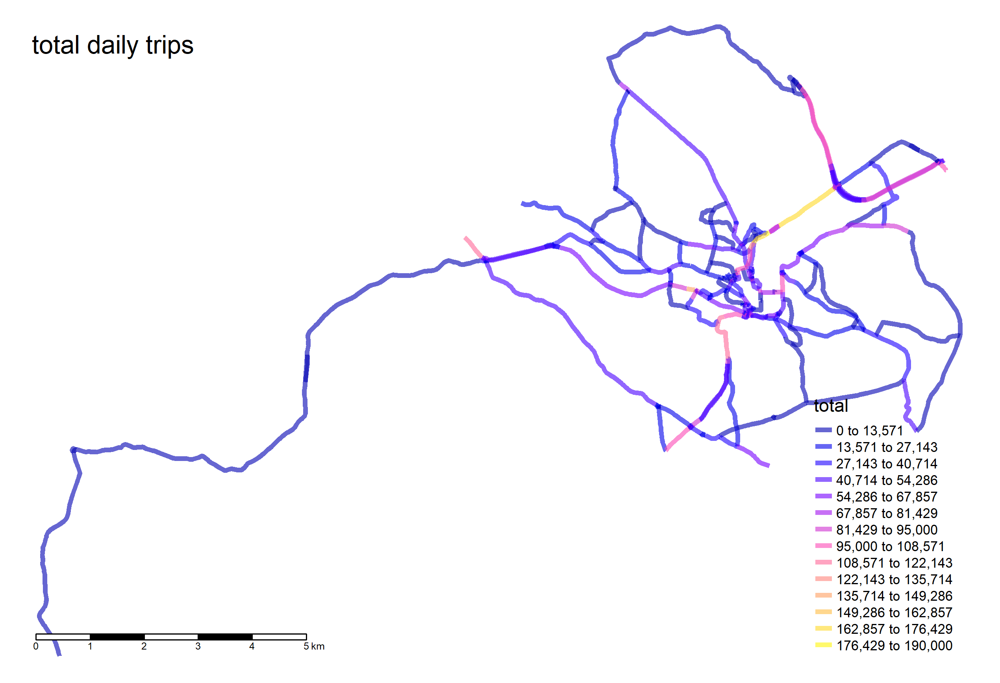

```{r setup, include=FALSE}
knitr::opts_chunk$set(echo = TRUE)

library(dplyr)
library(sf)
library(mapview)
library(lubridate)
library(stringr)
library(reshape2)
library(knitr)
library(tmap)
library(leaflet)

##define coordinate systems
latlong = "+init=epsg:4326"
rdnew = "+init=epsg:28992"

## read in vehicle hashed number plate data
car_dat <- readRDS("dat/ANPR/observations.RDS")
cam_dat <- read.csv("dat/ANPR/sites.csv")

#cam_dat_2021 <- read.csv("data/cams_2021_stadsdeel_gebied_knelpunt.csv", sep = ";")
min_d8 <- min(car_dat$date)
max_d8 <- max(car_dat$date)
car_id <- unique(car_dat$vehicle_id)[10]

```

## Introduction

This document discusses a reproducible method for analysis of Auto Number Plate Recognition (ANPR) cameras.

In October and November 2017 a traffic survey was carried out in and around the City of Bath to provide data to inform the Clean Air Zone (CAZ) modelling exercise. This data was released as part of a data hack by open data Bath. An analysis was carried out on the data to demonstrate how it can be used to provide traffic count, speed and ultimately emissions data for a road network. This method will also be compared with census survey data.

To preserve privacy, the data was provided with the vehicle number plates 'hashed' with a unique ID that stayed with the vehicle for the full period of data. Additional data can be provided with the ID, such engine data characteristics.

Two data sets were provided, camera information, including location, which will be called 'camera data' and a dataset which shows the ID and timestamp of vehicles that were sighted by each camera, which will be called 'vehicle data'.

The camera data locations are plotted below.

```{r camera_location, echo=FALSE, warning=FALSE}

df_sf <- cam_dat %>% 
  transmute(id, 
            street = description,
            x = as.numeric(longitude), 
            y = as.numeric(latitude),
            direction) %>% 
  st_as_sf(coords = c('x', 'y'), crs = latlong)


lat <- mean(st_coordinates(df_sf)[,2])
lon <- mean(st_coordinates(df_sf)[,1])

m <- leaflet() %>% 
  addProviderTiles("CartoDB.Positron", group = "CartoDB") %>%
  addProviderTiles("Esri.WorldImagery", group = "Esri Satellite") %>%
  addProviderTiles("OpenStreetMap", group = "Open Street Map") %>%
  setView(lon, lat, zoom = 12)

m <- m %>% addCircleMarkers(data = df_sf, color = "black", weight = 1,
                            opacity = 1.0, fillOpacity = 0.2, radius = 8,
                            fillColor = "#4FF54C",
                            popup = paste("ID:", df_sf$id, "<br>",
                                          "Street:", df_sf$street, "<br>",
                                          "Direction:", df_sf$direction, "<br>"), group = "Camera Locations")

m = m %>% addLegend("bottomleft", colors = c('#4FF54C'),labels = c("2019 Camera Points"),
                    title = "Camera Points",
                    opacity = 1)

m <- m %>% addLayersControl(overlayGroups = c("Camera Locations"),
                            baseGroups = c("CartoDB", "Esri Satellite", "Open Street Map"),
                            options = layersControlOptions(collapsed = FALSE), position = "topright")

m

```

## Generating route data

The 'vehicle data' is simply a time stamp, defined to the nearest second, for each vehicle observation that took place. An example for vehicle ID ``r car_id``, sorted from earliest sighting to last, with seconds since 1900-01-01 is shown in the table below.

```{r car_dat, echo=FALSE, warning=FALSE}

## define time limit in minutes
timelim <- 30

car_df <- car_dat %>% 
  select(date, Cameranummer = site_id, id) %>% 
  filter(id == car_id) %>% 
  arrange(id, date) %>% 
  mutate(seconds_since_1900 = as.numeric(seconds(date)))

kable(car_df, caption = paste0("sightings of ", car_id))

```

Calculating journey time between each sighting.

```{r car_journey, echo=FALSE,warning=FALSE}

df <- data.frame(from=head(car_df$Cameranummer, -1), to=tail(car_df$Cameranummer, -1))
df$journey_time <- tail(car_df$seconds, -1) - head(car_df$seconds, -1)
df$hour <- paste0(yday(car_df$date[1:(NROW(car_df)-1)]), "_", hour(car_df$date[1:(NROW(car_df)-1)]))

kable(df, caption = "Time stamps for each sighting", align = "c")

```

The time difference between some sightings is very large. It is likely these sightings represent the time between a journey ending and another starting or a trip that left the network and rejoined. Journey times of trips where a vehicle was parked up are not representative of traffic conditions for journeys that left the network estimating the route a vehicle took is difficult. Therefore, a token time limit of 30 minutes (1800 seconds) has been chosen to remove any journey that is longer than this in order to only include continuous journeys. Applying this to the example vehicle gives the following journey data.

```{r car_journey_filtered, echo=FALSE,warning=FALSE}

ret <- filter(df, journey_time < (timelim*60)) 

kable(ret, caption = "'Journeys' above time limit removed", align = "c")
  
```

## Origin Destination
Once the journeys in the data have been defined for each vehicle an origin destination (OD) matrix can be created to summarise the trips. One way of representing this is to use desire lines, which essentially is a straight line between nodes (cameras).

The desire lines for all the unique origin destination (OD) journeys undertaken during the full day are shown below. Average speed is represented by colour and flow represented by line width.


An animated loop showing how these vary for each hour of the day is shown below.


## Creating routes
To define flows and speeds for the roads in the network it is neccesary to determine which roads the vehicles travelled down between their OD points. This has been estimated using the osrm R package which takes a start and end point and returns a linestring representing the route.

However, location of the cameras provided in the dataset is somewhat ambiguous. An example of this is point 1002, shown in red below:

```{r camera_1002, echo=FALSE, warning=FALSE}

df_sf2 <- cam_dat %>% 
  transmute(id = Camera.ID..as.used.in.vehicle.passage.data., 
            street = Standplaatsomschrijving,
            x = as.numeric(WGS84.DD.Longitude..gr.), 
            y = as.numeric(WGS84.DD.Latitude..gr.),
            direction = Richting.van.het.verkeer) %>% 
  filter(id == '1002') %>% 
  st_as_sf(coords = c('x', 'y'), crs = latlong)

df_sf3 <- df_sf %>% 
  filter(!id == '1002')

lat <- mean(st_coordinates(df_sf2)[,2])
lon <- mean(st_coordinates(df_sf2)[,1])

m <- leaflet() %>% 
  addProviderTiles("CartoDB.Positron", group = "CartoDB") %>%
  addProviderTiles("Esri.WorldImagery", group = "Esri Satellite") %>%
  addProviderTiles("OpenStreetMap", group = "Open Street Map") %>%
  setView(lon, lat, zoom = 17)

m <- m %>% addCircleMarkers(data = df_sf3, color = "black", weight = 1,
                            opacity = 1.0, fillOpacity = 0.3, radius = 8,
                            fillColor = "#4FF54C",
                            popup = paste("ID:", df_sf3$id, "<br>",
                                          "Street:", df_sf3$street, "<br>",
                                          "Direction:", df_sf3$direction, "<br>"), group = "Camera Locations")

m <- m %>% addCircleMarkers(data = df_sf2, color = "black", weight = 1,
                            opacity = 1.0, fillOpacity = 0.6, radius = 8,
                            fillColor = "red",
                            popup = paste("ID:", df_sf2$id, "<br>",
                                          "Street:", df_sf2$street, "<br>",
                                          "Direction:", df_sf2$direction, "<br>"), group = "Camera 1002")

m = m %>% addLegend("bottomleft", colors = c('#4FF54C', 'red'),labels = c("2019 Camera Points", "Camera 1002"),
                    title = "Camera Data",
                    opacity = 1)

m <- m %>% addLayersControl(overlayGroups = c("Camera Locations", "Camera 1002"),
                            baseGroups = c("CartoDB", "Esri Satellite", "Open Street Map"),
                            options = layersControlOptions(collapsed = FALSE), position = "topright")

m

```

The site is almost equidistant to the road to the north and the south. The street name in the data more closely matches the road to the south, however visual inspection with Google Street View shows the camera is on the carriageway to the north of the camera:

<https://www.google.com/maps/@52.3930304,4.8699738,3a,75y,87.05h,84.91t/data=!3m6!1e1!3m4!1s_rPzgnxUb2_VLWhdljFkcA!2e0!7i16384!8i8192>

To ensure osrm uses the best start and end point locations an attempt has been made to 'snap' the points to the road that best matches the location of the camera and the direction of flow it is measuring.

The outcome of this process is shown below:

```{r camera_snapped, echo=FALSE, warning=FALSE}

snapped_pts <- readRDS("out/snapped_pts.RDS")
snapped_rds <- readRDS("out/snapped_rds.RDS")

lat <- mean(st_coordinates(df_sf)[,2])
lon <- mean(st_coordinates(df_sf)[,1])

snapped_rds <- mutate(snapped_rds, cntnt=paste0('<strong>OSM ID: </strong>',osm_id,
                                                '<br><Direction: </strong> ', direction)) 

m <- leaflet() %>% 
  addProviderTiles("CartoDB.Positron", group = "CartoDB") %>%
  addProviderTiles("Esri.WorldImagery", group = "Esri Satellite") %>%
  addProviderTiles("OpenStreetMap", group = "Open Street Map") %>%
  setView(lon, lat, zoom = 15)

m <- m %>% addCircleMarkers(data = df_sf, color = "black", weight = 1,
                            opacity = 1.0, fillOpacity = 0.3, radius = 8,
                            fillColor = "#4FF54C",
                            popup = paste("ID:", df_sf$id, "<br>",
                                          "Street:", df_sf$street, "<br>",
                                          "Direction:", df_sf$direction, "<br>"), group = "Original Camera Points")

m <- m %>% addCircleMarkers(data = snapped_pts, color = "black", weight = 1,
                            opacity = 1.0, fillOpacity = 0.6, radius = 8,
                            fillColor = "orange",
                            popup = paste("ID:", snapped_pts$id, "<br>"), group = "Snapped Camera Points")

m <- m %>% addPolylines(data = snapped_rds, color = "orange", weight = 4,
                        opacity = 1.0, fillOpacity = 0.2,
                        highlightOptions = highlightOptions(color = "white", weight = 2,
                                                            bringToFront = FALSE),popup = ~as.character(cntnt),
                        group = "Snapped Camera Roads")

m = m %>% addLegend("bottomleft", colors = c('#4FF54C', 'orange'),labels = c("Original", "Snapped"),
                    title = "Original vs Snapped",
                    opacity = 1)

m <- m %>% addLayersControl(overlayGroups = c("Original Camera Points", "Snapped Camera Points", "Snapped Camera Roads"),
                            baseGroups = c("CartoDB", "Esri Satellite", "Open Street Map"),
                            options = layersControlOptions(collapsed = FALSE), position = "topright")

m

```

Once a route has been assigned to each OD pair we have a full data

For OD points that are close together there can be a good degree of certainty as to the route, however for some OD points, particularly those that are far apart, the routes might not represent reality. In addition even the when a most likely route has been defined, human choice/error/road conditions might mean a vehicle did not go that way.

An example of a route that has a high degree of certainty and one with less is shown below. The route in orange is only a short stretch with little choice of route, where as the route highlighted in pink potentially has a number of alternative options, depending on the local road network.

``` {r certain_uncertain, echo=FALSE, warning=FALSE}

load("out/all_routes.RData")

lat <- mean(st_coordinates(all_routes)[,2])
lon <- mean(st_coordinates(all_routes)[,1])

all_routes <- mutate(all_routes, cntnt=paste0('<strong>Route ID: </strong>',routeID,
                                                '<br><Start Camera: </strong>', src,
                                              '<br><End Camera: </strong>', dst,
                                              '<br><Duration: </strong>', duration,
                                              '<br><Distance: </strong>', distance))

certain_route <- filter(all_routes, routeID == "3772001_3407001")
uncertain_route <- filter(all_routes, routeID == "10001_21002")

start_pts <- filter(snapped_pts, id %in% c(certain_route$src, uncertain_route$src))
end_pts <- filter(snapped_pts, id %in% c(certain_route$dst, uncertain_route$dst))

m <- leaflet() %>% 
  addProviderTiles("CartoDB.Positron", group = "CartoDB") %>%
  addProviderTiles("Esri.WorldImagery", group = "Esri Satellite") %>%
  addProviderTiles("OpenStreetMap", group = "Open Street Map") %>%
  setView(lon, lat, zoom = 12)

m <- m %>% addCircleMarkers(data = start_pts, color = "black", weight = 1,
                            opacity = 1.0, fillOpacity = 0.4, radius = 8,
                            fillColor = "green",
                            popup = paste("ID:", start_pts$id, "<br>"))

m <- m %>% addCircleMarkers(data = end_pts, color = "black", weight = 1,
                            opacity = 1.0, fillOpacity = 0.4, radius = 8,
                            fillColor = "red",
                            popup = paste("ID:", end_pts$id, "<br>"))

m <- m %>% addPolylines(data = certain_route, color = "orange", weight = 4,
                        opacity = 1.0, fillOpacity = 0.2,
                        highlightOptions = highlightOptions(color = "white", weight = 2,
                                                            bringToFront = FALSE),popup = ~as.character(cntnt))

m <- m %>% addPolylines(data = uncertain_route, color = "pink", weight = 4,
                        opacity = 1.0, fillOpacity = 0.2,
                        highlightOptions = highlightOptions(color = "white", weight = 2,
                                                            bringToFront = FALSE),popup = ~as.character(cntnt))

m = m %>% addLegend("bottomleft", colors = c('green', 'red', 'orange', 'pink'),
                    labels = c("start camera", "end camera", 'certain route', 'uncertain route'),
                    opacity = 1)

m <- m %>% addLayersControl(baseGroups = c("CartoDB", "Esri Satellite", "Open Street Map"),
                            options = layersControlOptions(collapsed = FALSE), position = "topright")

m

```

## Combining data
Generating routes for each OD grouping and matching with the hourly data results in many overlapping routes. In order to use this data to provide data for individual sections of road in the network this data needs to be combined in a way that gives weight to the geometry of the road.

The function 'overline' from the stplanr R package <https://rdrr.io/cran/stplanr/man/overline.html> does just that. The overlapping lines representing OD routes can are combined into a single route network. Below is the same OD plot shown earlier but with each OD grouping routed via the Open Street Maps algorithm and combined. For each road segment that overlaps, the flows from each journey are summed together.

The overline function also creates a spatial lines network, which enables it to be used for routing analysis <https://cran.r-project.org/web/packages/stplanr/vignettes/stplanr-route-nets.html>.

Daily aggregated flows are shown in the figure below



A summary of 4 hours of hourly aggregated data is shown in the figures below.

```{r, echo=FALSE,out.width="50%", out.height="25%",fig.cap="plot showing 4 selected hours",fig.show='hold',fig.align='center'}
knitr::include_graphics(c("out/plots/0_rnet.png","out/plots/8_rnet.png",
                          "out/plots/17_rnet.png","out/plots/20_rnet.png"), dpi = 1200)
```


## Next steps

### Validation with other datasets
The daily and hourly flows estimated for each link can be matched to other datasets to see how the values compare. A dataset that would be suitable for this is the NDW loop data for the motorway segments that are included in this study area.


### Emissions
Matching the vehicle ID to an instananeous emissions dataset/model for each vehicle would allow accurate emissions for each road segment and for each stage of driving to be established.

### Improved route estimation
Even if the most probable routes vehicles take between sightings are established there will always be some uncertainty as drivers make wrong turns, take unconventional routes. A visual analysis of the linestrings returned for some of the routes shows there is significant ambiguity for some of the longer routes. This data analysis of 2019 data was based on 221 cameras. 2021 camera data contains 800+ cameras, reducing the distance between vehicle sightings and potentially removing some uncertainty over the route a vehicle takes between cameras.

``` {r two_years_dat, echo=FALSE, warning=FALSE}

df_sf4 <- cam_dat_2021 %>% 
  transmute(id = cam_name, 
            street = straat,
            x = as.numeric(X), 
            y = as.numeric(Y),
            direction = Richting.van.het.verkeer) %>% 
  st_as_sf(coords = c('x', 'y'), crs = latlong)


m <- leaflet() %>% 
  addProviderTiles("CartoDB.Positron", group = "CartoDB") %>%
  addProviderTiles("Esri.WorldImagery", group = "Esri Satellite") %>%
  addProviderTiles("OpenStreetMap", group = "Open Street Map") %>%
  setView(lon, lat, zoom = 12)

m <- m %>% addCircleMarkers(data = df_sf, color = "black", weight = 1,
                            opacity = 1.0, fillOpacity = 0.3, radius = 8,
                            fillColor = "#4FF54C",
                            popup = paste("ID:", df_sf$id, "<br>",
                                          "Street:", df_sf$street, "<br>",
                                          "Direction:", df_sf$direction, "<br>"), group = "2019 Camera Points")

m <- m %>% addCircleMarkers(data = df_sf4, color = "black", weight = 1,
                            opacity = 1.0, fillOpacity = 0.3, radius = 8,
                            fillColor = "yellow",
                            popup = paste("ID:", df_sf4$id, "<br>",
                                          "Street:", df_sf4$street, "<br>",
                                          "Direction:", df_sf4$direction, "<br>"), group = "2021 Camera Points")

m = m %>% addLegend("bottomleft", colors = c('#4FF54C', 'yellow'),labels = c("2019 Camera Points", "2021 Camera Points"),
                    title = "Camera Data",
                    opacity = 1)

m <- m %>% addLayersControl(overlayGroups = c("2019 Camera Points", "2021 Camera Points"),
                            baseGroups = c("CartoDB", "Esri Satellite", "Open Street Map"),
                            options = layersControlOptions(collapsed = FALSE), position = "topright")

m

```

### Modelling movements
One way of getting a better understanding of vehicle movements through a network is to use a microsimulation model. Having origin destination and route data makes this process a lot easier and quicker to setup.
